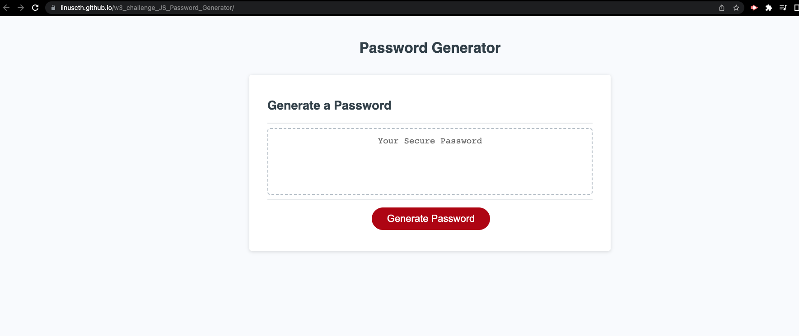

# 03 JavaScript: Password Generator

## description 

* this web appplication invloved implement algorithms on  jS and create a password generator. 

## Technologies Used
- HTML5
- JavaScript

## Setup

* 1. I define variables on eeach set of possible characters including number set, uppercase letters set, lowercase letter set, and special character set. 
* 2. I placed a lengthQuestion to figure out the length of the needed password. 
* 3. I use an if statement to limit the length of the passsword to be at least 8 characters and no more than 128. 
* 4. I placed 4 extra questions to idnetify the possible include characters
* 5. I create a variable possiblecharacters with an empty. 
* 6. I used 4 if- statements to concat the allowed characters into the possiblecharacters
* 7. I generate another new array with the requireed length based off the answer provide from length question.
* 8. I combine all elements in the array and create an string with .join
* 9. I return the string. 

## website
* repo: https://github.com/linuscth/w3_challenge_JS_Password_Generator
* url: https://linuscth.github.io/w3_challenge_JS_Password_Generator/

# screenshot 

